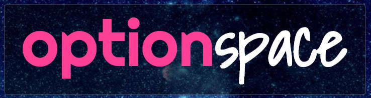

# 

## Factsheet

**Product:**
OptionSpace

**Developer:**  
Me and User, LLC

**Launch date:**  
November 9th, 2015

**Website:**  
[optionspace.co][homepage]

**Press / Business contact:**  
[press@optionspace.co][contact]

**Social:**  
[twitter.com/optionspace][twitter]  
<!-- [facebook.com/optionspaceapp][facebook]   -->
<!-- [Skype](callto:companyskypename) -->

**Address:**  
68 Jay St #718  
Brooklyn, NY 11201  

**Phone:**  
617-500-5755

## Overview

What if you could instantly make every app on your Mac just a little bit better?

OptionSpace is a utility for Mac OS X that gives you insanely fast keyboard access to any menu item, in any app with menus. 

No need to use the mouse, and, even better, no keyboard-combinations to memorize or recall. Just type a few letters of the menu item. It's that easy. OptionSpace helps keep you focused on what you're doing.

## Details

### History

When the original Macintosh&reg; was introduced in 1984, it had a menubar with pull down-menus running along the top of the screen. And that menubar hasn't changed much since.

More than 30 years later, Matt Morris, the lead developer of OptionSpace, was sick of wasting time trying to memorize obscure key combinations for occasionally used menu items. And sick of searching with the mouse to remember the location of some rarely used menu item.

He tried setting custom keyboard-shortcuts, but those took time to set up, and still required some effort to memorize. He tried using the Help menu's search feature, but it was just too brittle and limited. And thus, OptionSpace was born. Suddenly menu items everywhere were a *bit* smarter and a *whole lot* easier to use. 

### How OptionSpace is smarter

OptionSpace uses a custom-built fuzzy matching algorithm which can learn to predict what menu item you are looking for. You can recall previous commands using the built-in history. OptionSpace even understands when you search by acronym (e.g, to click "Save for web...", just type ("sfw") . OptionSpace works hard to make your experience easier.

### OptionSpace seems kind of like...

- *Spotlight&reg;*: Spotlight makes it easy to open files or applications on your computer. In other words, from the perspective of what you're working on right now, Spotlight is "outward-facing" search &mdash; it helps you get at other things. And it's great at it! OptionSpace, on the other hand, is "inward-facing" search. That is, it focuses on what you're working on now, and helps you stay in the zone. 

- *LaunchBar&trade;, Quicksilver, &amp; Alfred&reg;*: These apps are all amazing and have changed how we interact with our computers. For the most part, these are similar to Spotlight in that they are "outward-facing". Because they have extensive plug-in capabilities, there are optional ways of doing inward search in some of these apps.

- *The Help Menu Search*: OptionSpace is very similar to the Search box in the Help menu of Mac OS X. But OptionSpace takes a great idea and makes it more powerful, easier to use, and smarter. If you like the Help Menu's Search, you will LOVE OptionSpace.

<!-- ## Videos

We have a trailer and this is it. [And this is what we called the link](https://www.youtube.com/watch?v=WB0yAm6iXEw "Gunhouse Trailer on Youtube")  

<iframe src="//www.youtube.com/embed/WB0yAm6iXEw" frameborder="0" allowfullscreen></iframe>

 

This is some music from our games! [Yeah, you like it I think](http://www.youtube.com/watch?v=hxQAUADFCzw "Motohiro Kawashima live")
<iframe src="//www.youtube.com/embed/hxQAUADFCzw" frameborder="0" allowfullscreen></iframe> -->

## Images

download all screenshots & photos as ** [.zip (834 KB)](assets/images/optionspace-images.zip "Images zip") **

## Logo & Icon

download logo files as ** [.zip (52 KB)]( assets/images/optionspace-logo.zip "Logo & Icon zip") **

<!-- ## Awards & Recognition

> * "Winner, XX awards." - *game name, December 13, 2013*
> * "Nominee, YY awards." - *game name, December 13, 2013*

## Selected Articles

> * "Quote quote quote."  
-- *Person Name, [Website](http://www.website.com/)*

> * "More quotes."  
-- *Person name, [Site](http://geocities.blog.com/)* -->

## Additional Links

**Me and User, LLC**  
Developers of OptionSpace. Find us [here](https://meanduser.com)

## Team Members

Matt Morris  
*Founder*

## Contact

**Inquiries**  
[press@optionspace.co][contact]

**Twitter**  
[twitter.com/optionspace][twitter]

<!-- ** Facebook**  
[facebook.com/companyname][facebook] -->

**Web**  
[optionspace.co][homepage]

<!--- =====================================================================  -->
<!--- Referenced links -->

[homepage]: https://optionspace.co "OptionSpace"

[contact]: mailto:press@optionspace.co

<!--- Social -->

[twitter]: https://twitter.com/optionspace
<!-- [facebook]: https://facebook.com/companyname -->
<!-- [skype]: callto:companyskypename -->

<!--- Projects  -->

[example_project]: projects/exampleproject/
